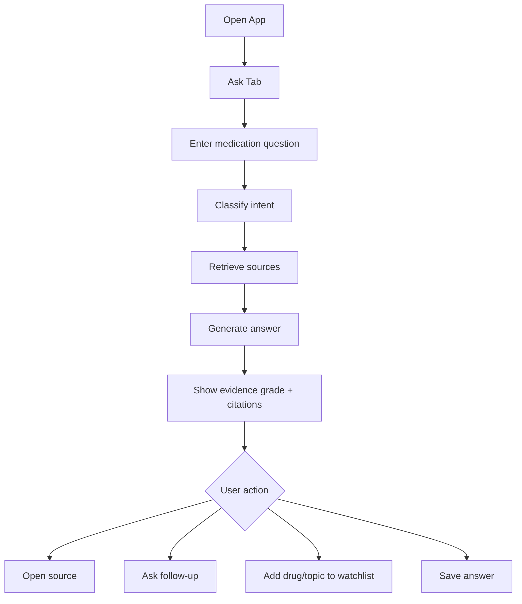
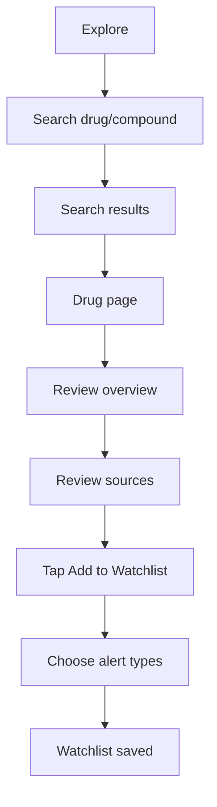
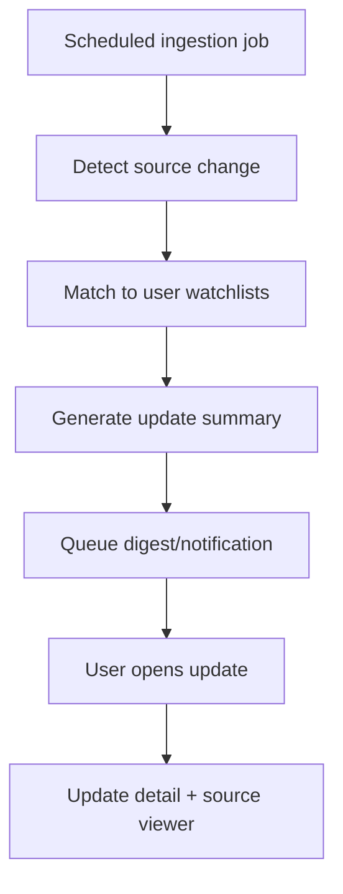
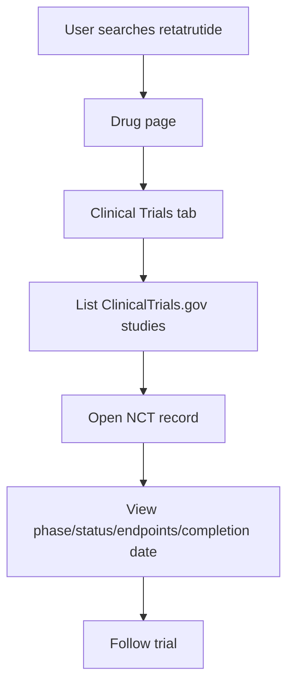
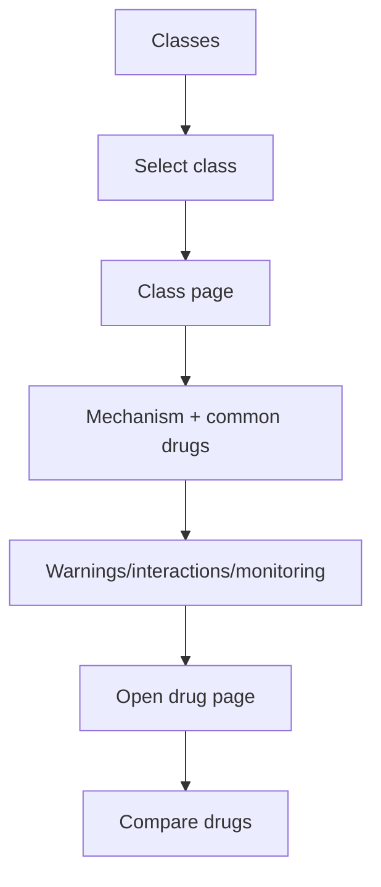
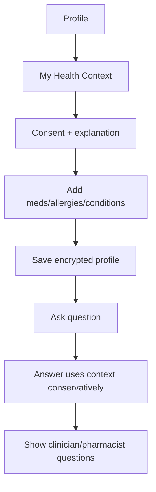
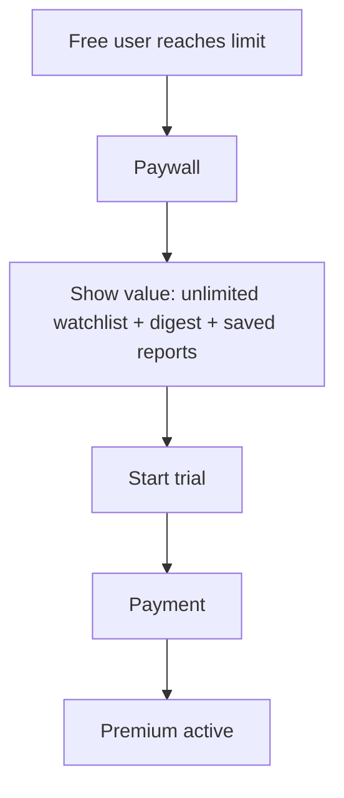
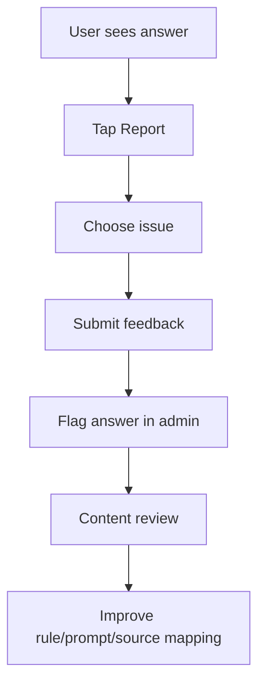

# User Flows — PharmaBro

## Flow 1 — Ask a question

## Flow 2 — Search drug and follow it

## Flow 3 — Watchlist update

## Flow 4 — Clinical trial tracker

## Flow 5 — Medication class learning

## Flow 6 — Optional My Health Context

## Flow 7 — Upgrade to paid

## Flow 8 — Report unsafe/incorrect answer

